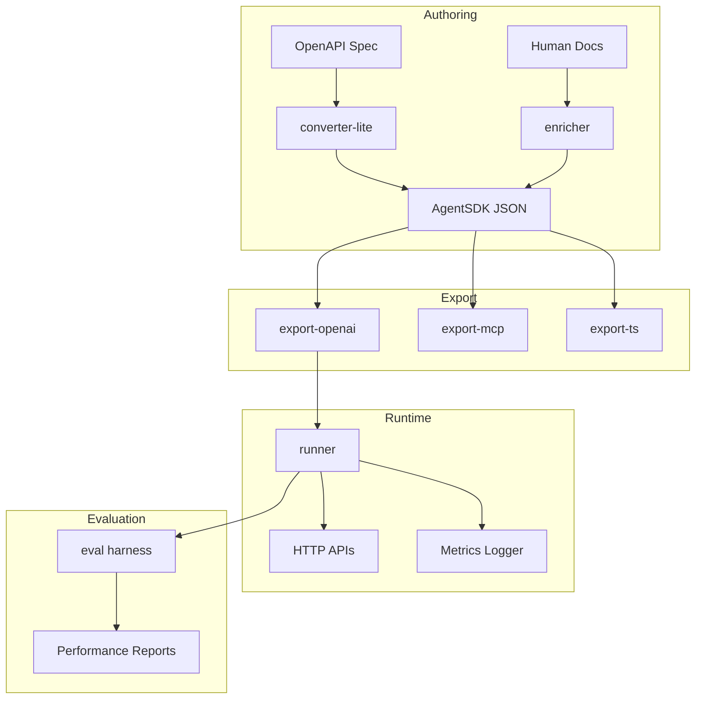

# AgentSDK

**The Gold Standard for Agent-First API Integration**

AgentSDK transforms traditional APIs into agent-optimized formats, delivering fewer invalid tool calls, lower token usage, and higher task success rates for AI coding agents.

## 🎯 Core Objective

Prove that structured AgentSDK (JSON + semantics) yields:

- **Fewer invalid tool calls** through schema validation
- **Lower token usage/latency** via compact structured representation
- **Equal or higher task success** compared to RAG-based documentation approaches

## 🏗️ Architecture



## 📦 Packages

| Package                     | Description                            | Status      |
| --------------------------- | -------------------------------------- | ----------- |
| `@agent-sdk/spec`           | JSON Schema specification & validation | ✅ Complete |
| `@agent-sdk/converter-lite` | OpenAPI → AgentSDK converter           | ⏳ Planned  |
| `@agent-sdk/enricher`       | LLM-powered semantic enhancement       | ⏳ Planned  |
| `@agent-sdk/export-openai`  | OpenAI function calling export         | ✅ Complete |
| `@agent-sdk/export-mcp`     | MCP tool manifest export               | ⏳ Planned  |
| `@agent-sdk/runner`         | Execution runtime with validation      | ✅ Complete |
| `@agent-sdk/eval`           | Evaluation harness                     | ✅ Complete |

## 🧪 Example SDKs

- **`demo-catfacts/`** - Simple REST API example for initial validation
- **`demo-slack-lite/`** - Multi-operation workflow example with rate limiting

## 🚀 Quick Start

```bash
# Install dependencies
npm install

# Build all packages
npm run build

# Run evaluation on CatFacts demo
cd packages/eval
npm run eval

# Convert an OpenAPI spec
npx @agent-sdk/converter-lite convert ./my-api.yaml

# Export to OpenAI tools format
npx @agent-sdk/export-openai ./sdks/demo-catfacts/agent-sdk.json
```

## 📋 AgentSDK Format

AgentSDK extends JSON Schema with agent-specific semantics:

```json
{
  "name": "MyAPI",
  "version": "1.0.0",
  "baseUrl": "https://api.example.com",
  "operations": [
    {
      "opId": "getUser",
      "method": "GET",
      "path": "/users/{id}",
      "input": { "type": "object", "properties": {...} },
      "output": { "type": "object", "properties": {...} },
      "x-guardrails": {
        "retry": "exponentialBackoff",
        "rateLimit": "100/minute"
      },
      "x-errors": [
        {
          "code": "USER_NOT_FOUND",
          "retryable": false,
          "recoveryHint": "Check user ID format"
        }
      ]
    }
  ],
  "x-usagePatterns": [
    {
      "name": "User Profile Flow",
      "steps": ["getUser", "getUserPreferences", "updateLastSeen"]
    }
  ]
}
```

## 🎯 Key Features

### Agent-Optimized Design

- **Structured Validation**: AJV-powered schema validation at runtime
- **Guardrails**: Built-in rate limiting, retry policies, and preconditions
- **Error Semantics**: Structured error codes with recovery hints
- **Usage Patterns**: Multi-step workflows and best practices

### Developer Experience

- **Type Safety**: Generated TypeScript types from JSON Schema
- **Multiple Exports**: OpenAI tools, MCP manifests, typed clients
- **Comprehensive Metrics**: Token usage, latency, success rates
- **Evaluation Framework**: A/B testing against baseline approaches

### Performance Focus

- **Token Efficiency**: Compact representation vs verbose documentation
- **Validation Speed**: Pre-compiled schema validators
- **Smart Retries**: Exponential backoff with circuit breaking
- **Parallel Execution**: Concurrent operation support

## 📊 Evaluation Results

_Coming soon - evaluation harness will compare AgentSDK vs baseline approaches_

## 🛠️ Development

```bash
# Install dependencies
npm install

# Build all packages
npm run build

# Run tests
npm run test

# Lint code
npm run lint

# Format code
npm run format
```

## 📖 Documentation

- [AgentSDK Specification](./packages/spec/README.md)
- [Conversion Guide](./packages/converter-lite/README.md)
- [Runner Usage](./packages/runner/README.md)
- [Evaluation Framework](./packages/eval/README.md)

## 🤝 Contributing

We welcome contributions! Please see our [Contributing Guide](./CONTRIBUTING.md) for details.

## 📄 License

This project is licensed under the AgentSDK License (ASL) - see [LICENSE](./LICENSE) for details.

**TL;DR**: Free for non-commercial use (research, education, open source projects). Commercial use requires a separate license.

For commercial licensing, enterprise support, or consulting services, please contact us.

---

**AgentSDK** - Making APIs speak the language of AI agents.

## 🔄 Normal API Docs vs AgentSDK Comparison

```mermaid
flowchart TD
    subgraph "Traditional Approach"
        A1["Normal API Docs<br/>(Markdown / HTML / PDF)"] --> B1["LLM reads text<br/>+ retrieves<br/>(token heavy)"]
        B1 --> C1["Infer intent<br/>& parameters<br/>(guess types, defaults, flows)"]
        C1 --> D1["Call API<br/>(trial & error)<br/>(often malformed)"]
        D1 --> E1["Observe error<br/>→ Retry/guess<br/>(\"429?\", \"400?\")"]
        E1 --> F1["Maybe fix<br/>after loops<br/>(latency, tokens)"]
    end

    subgraph "AgentSDK Approach"
        A2["AgentSDK<br/>(JSON Schema + semantics)"] --> B2["LLM sees tools<br/>(function defs)<br/>(token light)"]
        B2 --> C2["Emit structured call<br/>(JSON args per schema)"]
        C2 --> D2["Validate args w/ schema<br/>(reject invalid early)"]
        D2 --> E2["Execute w/ guardrails<br/>(retries, timeouts,<br/>preconditions)"]
        E2 --> F2["Structured error surface<br/>(\"rate_limit; wait=60s\")"]
        F2 --> G2["Complete task sooner<br/>(fewer tokens/loops)"]
    end

    style A1 fill:#ffebee
    style A2 fill:#e8f5e8
    style F1 fill:#ffcdd2
    style G2 fill:#c8e6c9
```
