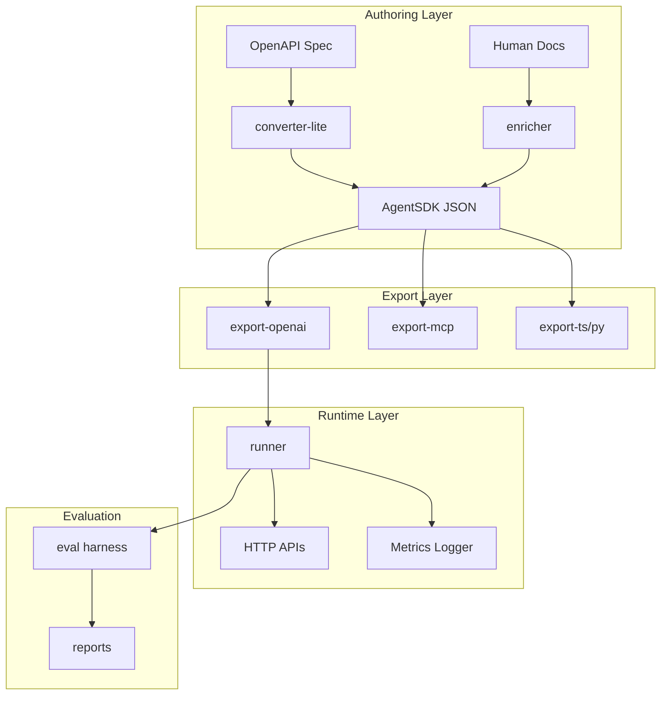

# AgentSDK System Architecture & Patterns

## Overall Architecture



## Core Modules

### 1. Specification (`packages/spec/`)

- **Purpose**: Define AgentSDK JSON Schema and validation
- **Key Files**: `agent-sdk.schema.json`, type definitions
- **Pattern**: Single source of truth for format

### 2. Converter Lite (`packages/converter-lite/`)

- **Purpose**: Deterministic OpenAPI → AgentSDK transformation
- **Pattern**: Pure functional mapping, no LLM dependencies
- **Input**: OpenAPI 3.x JSON/YAML
- **Output**: Base AgentSDK JSON (no x-\* fields)

### 3. Enricher (`packages/enricher/`)

- **Purpose**: LLM-powered semantic enhancement
- **Pattern**: Prompt-based extraction of agent semantics
- **Input**: Human docs + base AgentSDK
- **Output**: Enriched AgentSDK with x-\* fields

### 4. Export Modules

- **export-openai**: AgentSDK → OpenAI function calling schema
- **export-mcp**: AgentSDK → MCP tool manifest
- **export-ts/py**: Generate typed client libraries
- **Pattern**: Plugin architecture for different target formats

### 5. Runner (`packages/runner/`)

- **Purpose**: Agent execution runtime with validation and metrics
- **Key Components**:
  - Schema validation (AJV)
  - HTTP client with retry logic
  - Guardrails enforcement
  - Metrics collection
- **Pattern**: Middleware-based request/response processing

### 6. Evaluation (`packages/eval/`)

- **Purpose**: Comparative testing framework
- **Pattern**: Treatment-based A/B testing
- **Treatments**: Baseline-Docs vs AgentSDK
- **Metrics**: Tokens, latency, errors, success rate

## Design Patterns

### 1. Schema-First Development

- All data structures defined via JSON Schema
- Runtime validation at every boundary
- Type generation for multiple languages

### 2. Plugin Architecture

- Exporters as pluggable modules
- Extensible enrichment pipeline
- Configurable runner middleware

### 3. Metrics-Driven

- Comprehensive telemetry collection
- A/B testing built into core runtime
- Performance optimization feedback loops

### 4. Immutable Transformations

- Each stage produces new artifacts
- Clear provenance tracking
- Reproducible builds

## Data Flow Patterns

### Conversion Pipeline

```
OpenAPI Spec → [converter-lite] → Base AgentSDK → [enricher] → Full AgentSDK
```

### Runtime Execution

```
AgentSDK → [export-openai] → OpenAI Tools → [LLM] → Tool Calls → [runner] → HTTP → Results
```

### Evaluation Loop

```
Task Definition → [baseline/agentsdk runners] → Metrics → [reporter] → Analysis
```

## Error Handling Patterns

### 1. Structured Error Responses

- Standardized error codes across all modules
- Recovery hints for common failures
- Retryable vs non-retryable classification

### 2. Graceful Degradation

- Fallback behaviors when enrichment fails
- Partial success handling in batch operations
- Conservative defaults for missing semantics

### 3. Validation Layers

- Schema validation at ingress/egress
- Runtime parameter validation
- Output format verification

## Security Patterns

### 1. Credential Management

- Environment-based API key injection
- No secrets in logs or artifacts
- Configurable redaction policies

### 2. Network Isolation

- Optional NO_NETWORK mode for testing
- Configurable HTTP client policies
- Request/response sanitization

### 3. Input Validation

- Strict schema enforcement
- Parameter sanitization
- Rate limiting compliance
